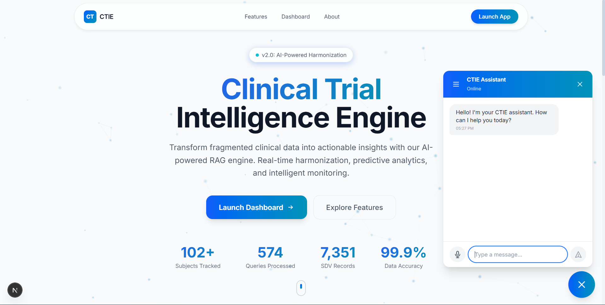
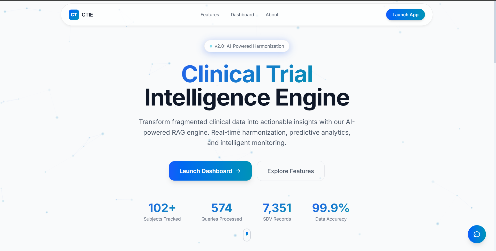
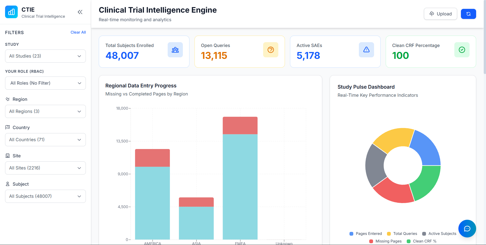
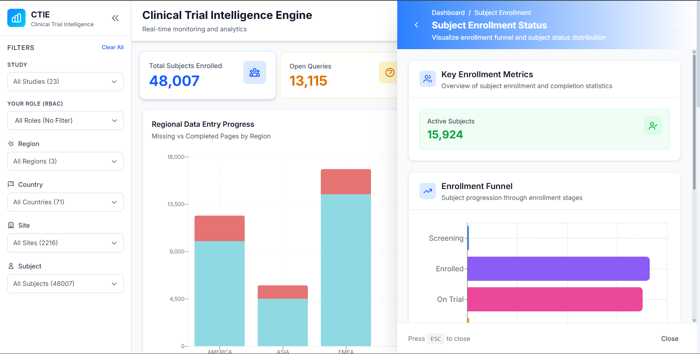
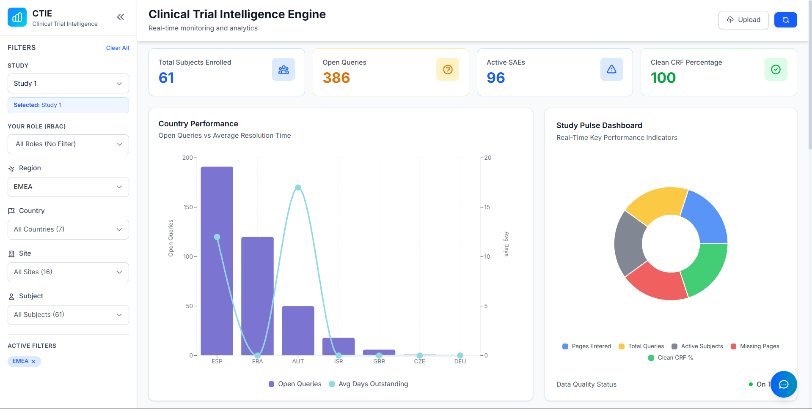
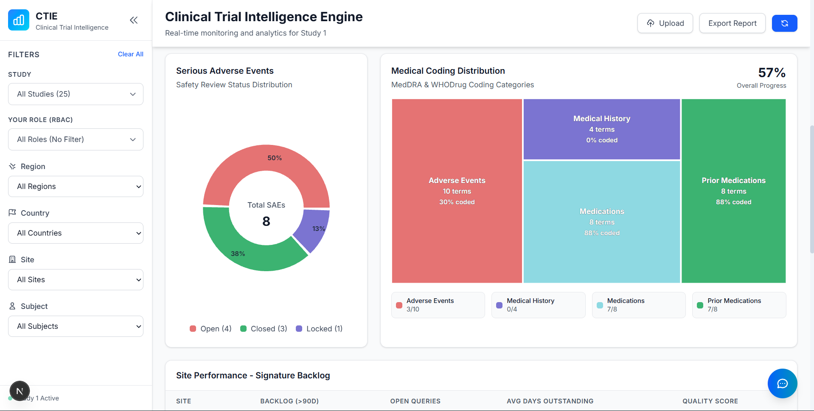
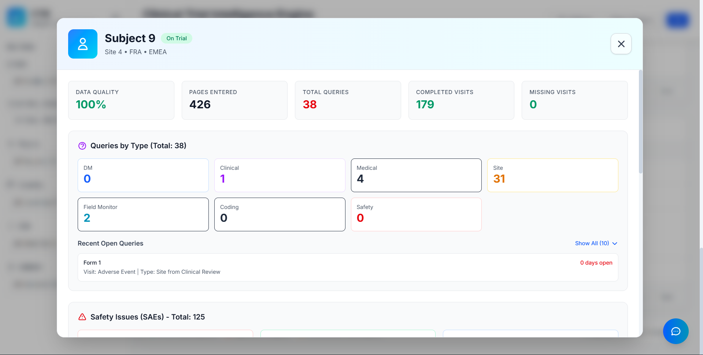
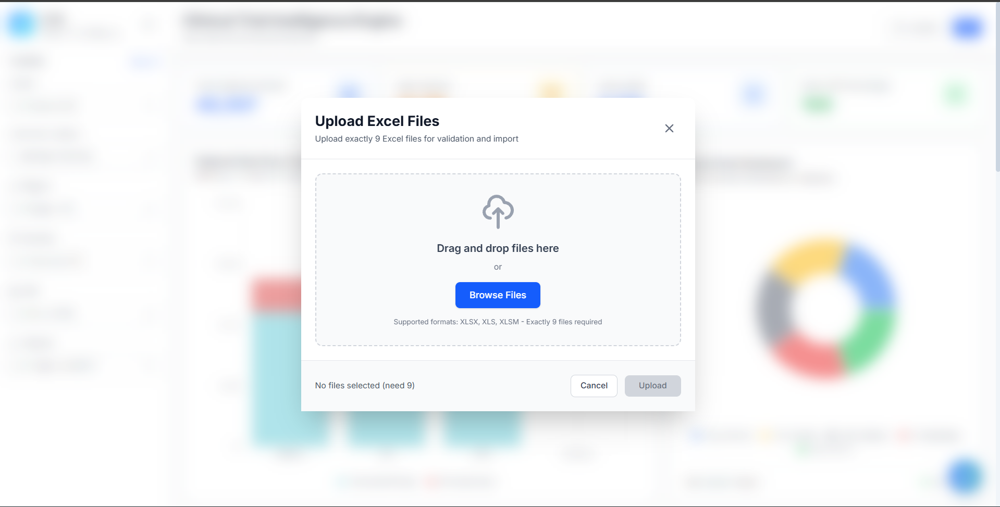

# CTIE - Clinical Trial Intelligence Engine

> AI-powered clinical trial data harmonization and analytics platform



## 📋 Problem Statement

Clinical trials generate vast amounts of heterogeneous data from multiple sources, including:

- **Electronic Data Capture (EDC) systems**
- **Laboratory reports**
- **Site operational metrics**
- **Monitoring logs**

However, these data streams often remain **siloed**, leading to:

- Delayed identification of operational bottlenecks
- Inconsistent data quality
- Limited visibility for scientific decision-making

Current processes rely heavily on **manual review** and **fragmented communication** between Clinical Trial Teams (CTT), Clinical Research Associates (CRAs), and investigational sites, which increases cycle times and operational risk.

---

## 🎯 Challenge Statement

There is a critical need for an **integrated solution** that can:

1. **Ingest and harmonize** clinical and operational data in near real-time
2. **Apply advanced analytics** to generate actionable insights
3. **Proactively detect** data quality issues and operational inefficiencies

Furthermore, the solution should leverage **Generative and Agentic AI** capabilities to:

- Enable intelligent collaboration
- Automate routine tasks
- Provide context-aware recommendations to stakeholders

This accelerates trial execution and improves scientific outcomes.

---

## ✨ Features

### Landing Page

- Modern, professional UI with animated particles background
- Interactive hero section with call-to-action
- Bento-style feature grid showcasing capabilities
- Dashboard preview section
- AI-powered chatbot with voice input

### Dashboard Insights

The dashboard provides comprehensive real-time insights across multiple domains:

#### 📊 KPI Cards

- **Total Subjects** - Active trial participants
- **Total Queries** - Data clarification requests
- **SDV Records** - Source Data Verification count
- **Site Count** - Active clinical sites
- **Enrollment Rate** - Subject recruitment velocity
- **Query Resolution Rate** - Efficiency metrics

#### 📈 Data Visualizations

| Chart                          | Description                                                                        |
| ------------------------------ | ---------------------------------------------------------------------------------- |
| **Regional Stacked Bar Chart** | Data entry progress by region (North America, Europe, Asia Pacific, Latin America) |
| **Country Composed Chart**     | Country-level performance metrics with dual-axis visualization                     |
| **SAE Donut Chart**            | Serious Adverse Events distribution by category                                    |
| **Coding Treemap**             | Medical coding categories visualization with hierarchical data                     |

#### 🔬 Study Pulse Panel

- Real-time study health monitoring
- Key metrics at a glance
- Alert indicators for issues requiring attention

#### 📋 Data Tables

- **Site Performance Table** - Detailed site-level metrics with click-through navigation
- **Subject Table** - Individual subject data with risk indicators
- **Patient 360 Modal** - Comprehensive patient view with:
  - Visit timeline
  - Missing visits tracking
  - Lab results
  - SAE history
  - Data quality score

---

## 🖼️ Screenshots

### Landing Page


_Interactive landing page featuring animated particle effects and glassmorphism UI elements_

### Dashboard Overview


_Main dashboard displaying real-time KPI metrics and regional data analytics_


_Detailed drill-down view for individual KPI card analysis_


_Advanced filtering capabilities by study and geographic region_

### Dashboard Analytics


_Advanced visualizations showing Serious Adverse Event distribution and hierarchical medical coding analysis_

### Patient 360 View


_Comprehensive patient profile with complete visit timeline, lab results, and adverse event tracking_

### Upload Feature for Excel Sheets


_Dynamic data ingestion with real-time dashboard updates upon study file upload_

---

## 🚀 Getting Started

### Prerequisites

- Node.js 18+
- npm/yarn/pnpm/bun

### Installation

```bash
# Clone the repository
git clone "https://github.com/pranavbafna586/NEST-Dashboard"
cd nest

# Install dependencies
pnpm install
```

### Development

```bash
pnpm dev
```

Open [http://localhost:3000](http://localhost:3000) with your browser to see the result.

---

## 📁 Project Structure

```
nest/
├── app/
│   ├── page.tsx              # Landing page
│   └── dashboard/
│       └── page.tsx          # Dashboard insights page
├── components/
│   ├── landing/              # Landing page components
│   │   ├── Header.tsx
│   │   ├── Hero.tsx
│   │   ├── ParticlesBackground.tsx
│   │   ├── BentoFeatures.tsx
│   │   ├── DashboardPreview.tsx
│   │   ├── Footer.tsx
│   │   └── Chatbot.tsx
│   ├── dashboard/            # Dashboard components
│   │   ├── Sidebar.tsx
│   │   ├── KPICards.tsx
│   │   ├── StudyPulse.tsx
│   │   ├── DataTable.tsx
│   │   ├── Patient360.tsx
│   │   └── UploadDialog.tsx
│   └── charts/               # Data visualization components
│       ├── RegionStackedBarChart.tsx
│       ├── CountryComposedChart.tsx
│       ├── SAEDonutChart.tsx
│       ├── CodingTreemap.tsx
│       └── PatientVisitTimeline.tsx
├── data/
│   └── mockData.ts           # Data processing and aggregation
├── hooks/
│   └── useSpeechRecognition.ts
└── types/
    └── index.ts
```

---

## 🛠️ Tech Stack

- **Framework**: [Next.js 16](https://nextjs.org/) with App Router
- **Language**: TypeScript
- **Styling**: Tailwind CSS
- **Charts**: Recharts
- **AI Integration**: Google Gemini API
- **Icons**: Lucide React

---

## 📊 Data Sources

The dashboard ingests and processes data from the following sources:

- QC Anonymized Study Files (Excel datasets)
- Subject demographics and enrollment
- Query management records
- Source Data Verification (SDV) logs
- Serious Adverse Events (SAE) reports
- Medical coding data

---
